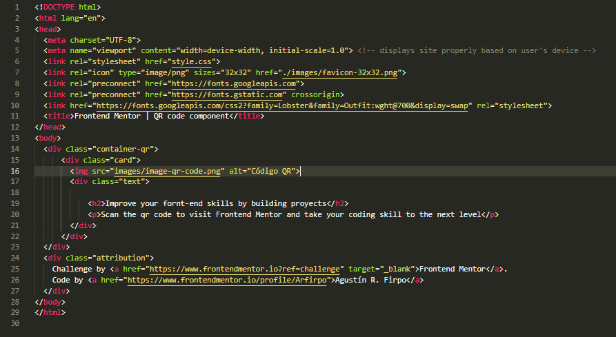
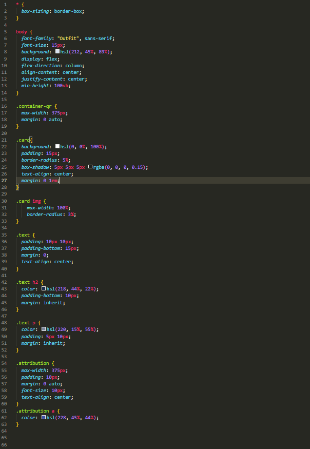

# Frontend Mentor - QR code component solution

This is a solution to the [QR code component challenge on Frontend Mentor](https://www.frontendmentor.io/challenges/qr-code-component-iux_sIO_H). Frontend Mentor challenges help you improve your coding skills by building realistic projects. 

## Table of contents

- [Descripción General](#Descripción)
  - [Screenshot](#screenshot)
  - [Links](#links)
  - [Built with](#built-with)
  - [What I learned](#what-i-learned)
  - [Continued development](#continued-development)
  - [Useful resources](#useful-resources)
- [Author](#author)
- [Acknowledgments](#acknowledgments)

**Note: Delete this note and update the table of contents based on what sections you keep.**

## Descripción

Solución para el desafio de creación de un componente de codigo qr.

### Screenshot

### Links

- Solution URL: [http://127.0.0.1:5500/Frontend%20Mentor/Proyectos/qr-code-component-main/qr-code-card.html]

### Built with

- Semantic HTML5 markup
- CSS custom properties
- Flexbox
- Mobile-first workflow

### What I learned

En este desafio reforcé principlalmente los siguientes conceptos:
-Display Flex.
-Gestión y personalización de la etiqueta div.
-Uso de distintas medidas: porcentajes, em, rem, pixeles y viewport height.

### Continued development

En lo sucesivo me gustaria profundizar conceptos respecto de las distintas medidas fijas y relativas de los elementos como así también perfeccionar mi box-mpdeling y manejo de los display grid/flex.

## Author
- Frontend Mentor - [@Arfirpo_](https://www.frontendmentor.io/profile/Arfirpo)
- Twitter - [@yourusername](https://twitter.com/agus_firpo)

## Acknowledgments

Agradecimiento especial al youtuber Mr Coder (https://www.youtube.com/@MrCoderYt) cuyo tutorial me guió para corregir mi desafio y aprender conceptos que no estaba utilizando hasta el momento.

